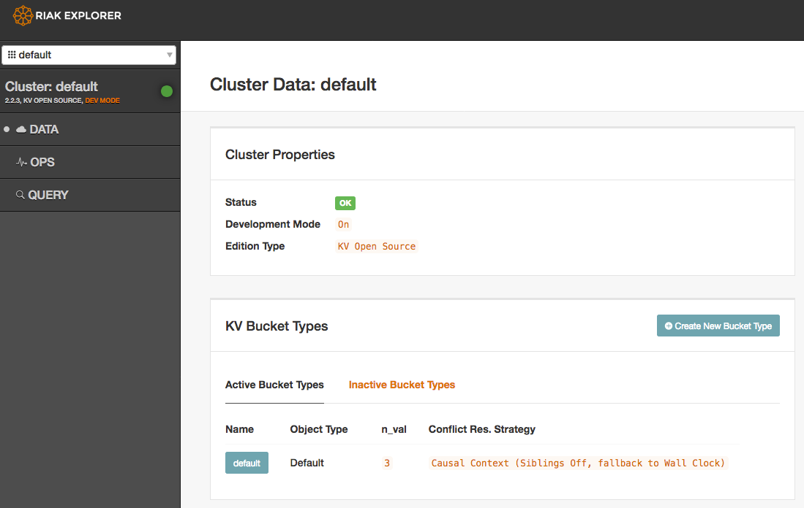

# Riak-kv-docker

Riakを試せるdocker環境



[basho/riak-kv](https://hub.docker.com/r/basho/riak-kv/)を参考に作成している

# 起動

コンテナを起動する
```
% docker-compose up -d coordinator 
```

web UIを開く

http://localhost:8098/admin/
