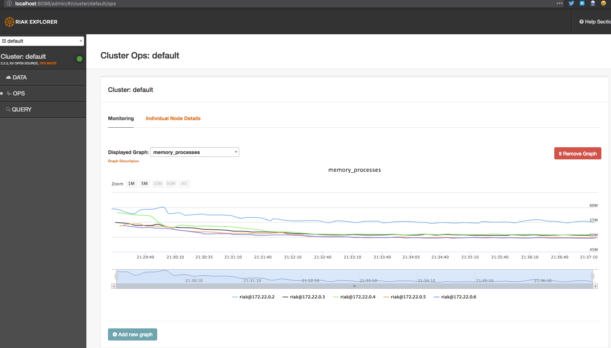

# Riak-kv-docker

Riakを試せるdocker環境


[basho/riak-kv](https://hub.docker.com/r/basho/riak-kv/)を参考に作成している

## 起動

コンテナを起動する
```bash
% docker-compose up -d coordinator 
```

web UIを開く

http://localhost:8098/admin/

## 簡単な動作確認

以下の手順でデータを登録する


その後curlを叩くを値が取得できる事が確認できる

```bash
% curl http://localhost:8098/admin/riak/clusters/default/types/default/buckets/sample/keys/key
{"sample-Key":"sample-value"}
```

### web UIを使わずにcurlから直接PUTしてみる

以下を実行する

```bash
% curl -v -X PUT http://localhost:8098/riak/favs/db -H "Content-Type: text/html" -d "<html><body><h1>My new favorite DB is RIAK</h1></body></html>"
```

ブラウザから http://localhost:8098/riak/favs/db にアクセスする


## ノードを増やしてみる

以下を実行する

```bash
% docker-compose scale member=4
```

coordinatorとは別にmemberノードを4つ増やし、合計5ノードに拡張する
http://localhost:8098/admin/#/cluster/default/ops を確認すると拡張された様子が確認出来る


